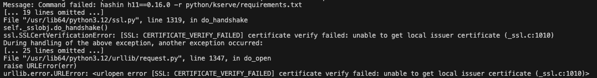

# Renovate Log Analyzer (used as part of the [MintMaker](https://github.com/konflux-ci/mintmaker) service)
<small>*Original content drafted by Cursor was reviewed and edited*</small>

This repository contains a Go implementation for analyzing Renovate logs and extracting categorized errors, warnings, and info messages. The implementation provides both level-based error extraction and message-based pattern matching for Renovate logs.

Another part of this repo is the KITE client, which takes the information after analyzing the logs and sends it to [KITE API](https://github.com/konflux-ci/kite) to be displayed on an Issue dashboard in Konflux UI.

This service is meant to run as one step of a `tekton pipeline` created by [MintMaker controller](https://github.com/konflux-ci/mintmaker).

## Log analyzer

- **`checks.go`**: Check definitions with selector registration for message-based pattern matching
- **`models.go`**: Data models including `LogEntry`, `PodDetails`, and `SimpleReport`
- **`report.go`**: Simple report functionality for collecting categorized messages
- **`log_reader.go`**: Log processing logic for extracting logs from a `json` file and parsing them into `Go` object

## Architecture

### Dual Processing Approach

The implementation provides two complementary approaches for log analysis:

1. **Level-based extraction**: Extracts ERROR and FATAL messages based on log level for `FailureLogs` (used only in the case of a failed PipelineRun)
2. **Message-based extraction**: Uses pattern matching to categorize messages into errors, warnings, and info (used always)

### Selector Pattern - main logic taken from [mintmaker-e2e logdoc checks](https://gitlab.cee.redhat.com/rsaar/mintmaker-e2e/-/tree/main/tools?ref_type=heads)

The message-based approach uses selector pattern matching:

```go
// Register a selector at initialization
func init() {
    RegisterSelector("Base branch does not exist - skipping", baseBranchDoesNotExist)
}

// Check function
func baseBranchDoesNotExist(line *LogEntry, report *SimpleReport) {
    report.Error("Base branch does not exist", 
        "hint", "Check `baseBranchPatterns` in renovate.json")
}
```

### Simple Report System

The implementation uses a simplifie report system:

```go
type SimpleReport struct {
    Errors   []string
    Warnings []string
    Infos    []string
}

func (r *SimpleReport) Error(msg string, fields ...interface{}) {
    // Format and add to Errors slice
}
```

## Usage Example

```go
// Process logs from a failed pod
func GetFailedPodDetails(ctx context.Context, client client.Client, Clientset *kubernetes.Clientset, pipelineRun *tektonv1.PipelineRun) (*PodDetails, error) {
    // The function automatically processes logs and returns structured results
    return &PodDetails{
        Name:        taskRun.Status.PodName,
        Namespace:   pipelineRun.Namespace,
        TaskName:    getTaskRunTaskName(taskRun),
        FailureLogs: reason,          // Level-based errors (ERROR/FATAL)
        Error:       report.Errors,   // Message-based errors
        Warning:     report.Warnings, // Message-based warnings
        Info:        report.Infos,    // Message-based info
    }, nil
}
```

## Selector List

All selectors from the [mintmaker-e2e logdoc checks](https://gitlab.cee.redhat.com/rsaar/mintmaker-e2e/-/tree/main/tools?ref_type=heads) are implemented with some changes:

1. `"Reached PR limit - skipping PR creation"` - Warning
2. `"Base branch does not exist - skipping"` - Error
3. `"Config migration necessary"` - Warning
4. `"Found renovate config errors"` - Error
5. `"branches info extended"` - Info
6. `"PR rebase requested=true"` - Info
7. `"rawExec err"` - Error
8. `"Ignoring upgrade collision"` - Warning
9. `"Platform-native commit: unknown error"` - Error
10. `"File contents are invalid JSONC but parse using JSON5"` - Error
11. `"Repository has changed during renovation - aborting"` - Error
12. `"Passing repository-changed error up"` - Error

## Log Levels

Following [Renovate documentation](https://docs.renovatebot.com/troubleshooting/):

- **TRACE**: 10
- **DEBUG**: 20
- **INFO**: 30
- **WARN**: 40
- **ERROR**: 50
- **FATAL**: 60

## ExtractUsefulError Function

The `ExtractUsefulError` function intelligently extracts the most useful parts of potentially long error messages. It's designed to reduce noise while preserving critical information and context.

### How It Works

1. **Preserves the first line**: Always keeps the initial error message for context
2. **Identifies critical lines**: Uses regex patterns to detect important error lines (e.g., "Command failed:", "Error:", "FATAL:", "Caused by:", etc.)
3. **Maintains context**: Keeps a rolling buffer of recent non-critical lines for context
4. **Preserves the end**: Always includes the last few lines of the error message
5. **Filters noise**: Skips empty lines and lines containing only symbols (like `~`, `^`, `=`)
6. **Limits output**: Restricts output to a maximum number of lines (default: 8) to keep messages concise (it can be a little bit more, because of the last 3 lines being added after the max length check)

### Example

The function transforms verbose error messages into concise, actionable summaries. The images below demonstrate the transformation:

**Before** - Full verbose error message with many lines of stack traces and context:


**After** - Same error after processing with `ExtractUsefulError`, highlighting only the critical parts:



The function is used automatically in the `rawExecError` check function to provide cleaner, more readable error messages in reports.

### Usage

```go
// Extract error with default max lines (8)
shortError := ExtractUsefulErrorDefault(fullErrorMessage)

// Extract error with custom max lines
shortError := ExtractUsefulError(fullErrorMessage, 10)
```

## KITE client
- **`client.go`**: Contains everything needed to communicate with the [KITE API backend](https://github.com/konflux-ci/kite/tree/main/packages/backend) - defines Payload structures, initializes the client and contains functions to send requests